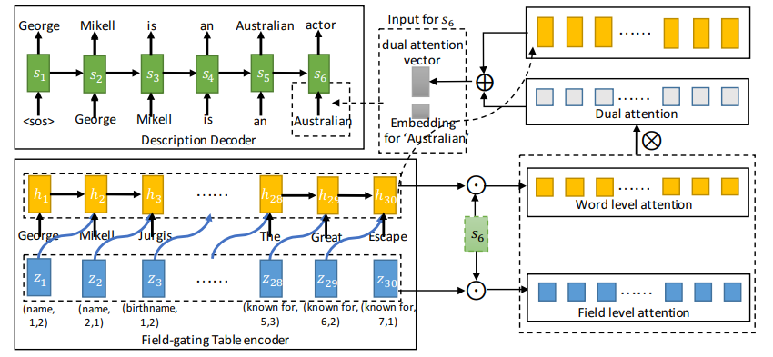
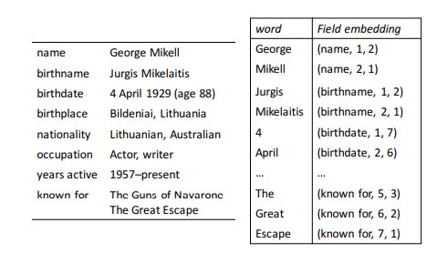
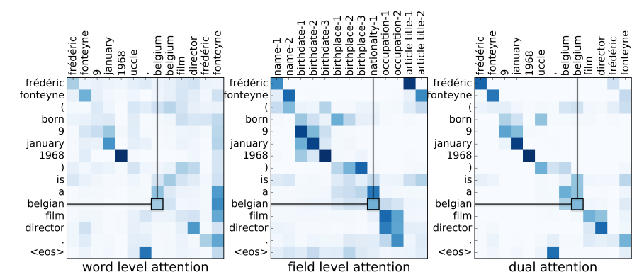

## Table-to-text Generation by Structure-aware Seq2seq Learning @jittor

This reporitory provides a reimplementation based on jittor for the paper 'Table-to-text Generation by Structure-aware Seq2seq Learning' selected in AAAI2018. 

这个仓库是基于jittor开源平台[1] 的 AAAI2018 论文[2] 'Table-to-text Generation by Structure-aware Seq2seq Learning' 的复现版本。

#### Introduction of the paper 论文介绍

从结构化的表格到序列文本生成是自然语言生成（NLG）领域的重要任务。很多过往的作者基于不同的精巧结构设计了不同的针对复杂图和表格结构的隐层表示方法。《Table-to-text Generation by Structure-aware Seq2Seq Learning》文章作者基于Seq2seq模型增加了对于结构化输入的适应，更好的完成了wiki表格（结构化数据）到序列文本（非结构化数据）的生成任务。

Generating natural language description for a structured table is an important task for text generation from structured data, and also a vital task for natural language generation. Past authors had designed different latent embedding and representation methods based on subtle structures and sub-models. Tianyu Liu, et al. added structure-aware adaption topological structure based on Vanilla seq2seq backbone and outperformed past models in this task.

作者将机器对于结构化文本的转换和人对于结构化文本的转换进行了建模和关联。作者认为结构化的提取和表示主要分为两个部分：local addressing和global addressing。这是源于作者认为结构化的表格本质上是多个field（域）和value（值）的映射。这样对表信息的抽取主要分为两部分：一部分是对于域之间关联，域的重要程序的提取，也就是field-level的嵌入表示；另一部分是对于域内部上下文关联，内容的提取，也就是context-level，或word-level的嵌入表示。其中local addressing主要指如何建模局部的文本之间的关联，选择表中重要的文本用于生成，global addressing指如何建模域文本之间的关联，将域文本更好的串联成自然语言的序列。

The author correlates the neural network's behaviour with human's behaviour when writing biography for a person based on the related wikipedia infobox. The author thinks that structure information need local addressing and global addressing to fully extract the structured information. In fact, table could be seen as the a map of multiple field and value pairs. Therefore, when extracting information of a table, the relation between fields and within fields are both important. Thus local addressing is utilized, targeted at modeling correlations between local content, and global addressing is utilized, targeted at field-level relation construction.

作者利用WIKI2BIO数据集尝试了两种不同的实验，给出了统计和测试结果，模型超参和训练细节，并提供了具体的案例分析(case study)。首先，作者和Kneser-Ney模型，基于模板生成的Kneser-Ney模型，NLM，table NLM，Vanilla Seq2seq模型对比，展示了作者所提出的模型在BLEU-4和ROUGE-4分数上有较大提升，并通过提供注意力的热力图证明作者提出的模型确实关注到了域级别，域内部词汇级别两层次的相关关系。此外，作者进一步通过打乱表格内部顺序，通过类似消融实验的形式证明即使表格内部内容顺序打乱作者也能较好建模和生成语句，这证明了global addressing和local addressing机制的有效性。作者还提供了具体的生成样例以及和baseline模型的结果比较，可以看到作者提供的生成更自然。

The author conducted the experiment based on WIKI2BIO dataset, giving training and testing results as well as details. The author also provided case studies for analysis. First, the author provides comparison of the BLEU-4 and ROUGE-4 among his model and other baseline models including KN, Template KN, NLM, Table MLM, Vanilla Seq2seq. He also provides attention maps to prove the correlation he enhanced. Second, he focused on disordered tabls and prove his attention mechanism worked well on these dataset, resulting in a low dropping of score. He also provided overall generation cases with comparison to baselines.

#### How to use this repo 使用方法

-tf  **Tensorflow版本，在根目录下运行 python wiki2bio_tf/src/Main.py 即可** run `` sh wiki2io_tf/src/Main.py`` and try the tensorflow version 

-jittor **计图复现版本，在根目录下运行 wiki2bio_jittor/src/run.sh 即可** run `` sh wiki2io_jittor/src/run.sh`` and try the jittor version . 将main.test中的`evaluate`函数修改为`evaluate_beam`即可实现beamsearch。

-doc  **一些文档信息和图片** document information and pictures

-README.md   **说明** readme

#### Reference 参考

[1]. jittor 即时编译深度学习框架 [Jittor(计图): 即时编译深度学习框架 — Jittor (tsinghua.edu.cn)](https://cg.cs.tsinghua.edu.cn/jittor/)

[2]. \[AAAI2018\] [Table-to-text Generation by Structure-aware Seq2seq Learning (tyliupku.github.io)](https://tyliupku.github.io/papers/aaai2018_liu.pdf)

#### Updating 更新记录

##### 2022/1/1 

增加注释和说明

##### 2021/12/24

增加时间测试程序部分，提供稳定版本 v0.2

##### 2021/12/22

增加beam search，提供稳定版本 v0.1

##### 2021/12/19

提高效率和可用性，增加tensorboard记录，提供稳定版本 v0.0

##### 2021/12/11

增加了dataloader和sequnit部分

##### 2021/12/6

增加了jittor初步版本

##### 2021/11/30

初始化仓库和tensorflow版本（原论文版本）

